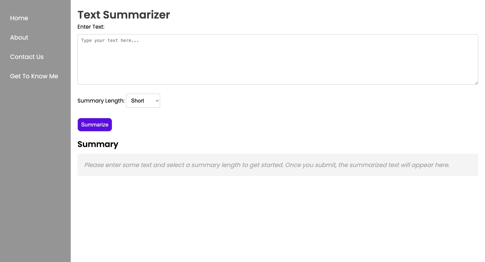
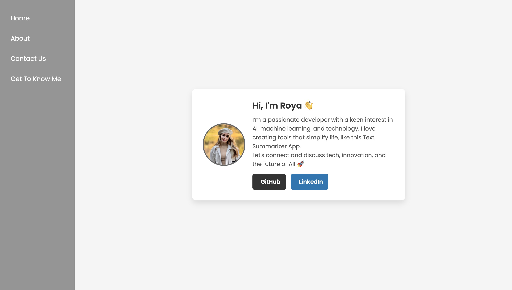
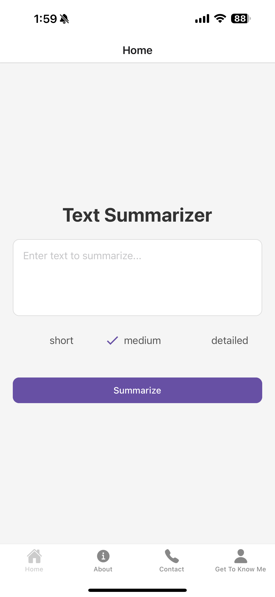
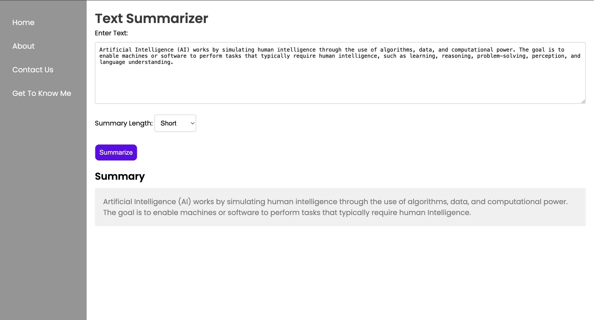
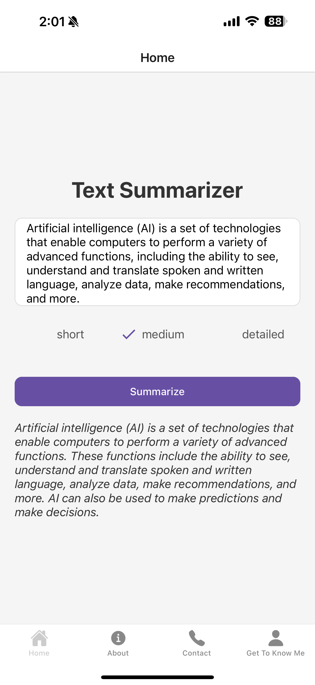

# Text Summarizer App

The **Text Summarizer App** is a web and mobile application that allows users to input large chunks of text and receive summarized versions in various lengths: short, medium, or detailed. This app uses a powerful summarization API (powered by Python) to generate concise summaries based on the input text, helping users save time when working with lengthy documents or articles.

## Table of Contents

- [About the App](#about-the-app)
- [Features](#features)
- [Technologies Used](#technologies-used)
- [Backend Setup](#backend-setup)
- [Frontend Setup](#frontend-setup)
- [Installation](#installation)
- [Usage](#usage)
- [Screenshots](#screenshots)
- [Contributing](#contributing)
- [License](#license)

---

## About the App

The **Text Summarizer App** allows users to quickly and easily generate summaries of any text. The app provides three options for summary length:
- **Short**: A brief summary that captures the key points.
- **Medium**: A more detailed summary covering important sections.
- **Detailed**: A thorough summary with more detailed information.

The app leverages the `summarize` endpoint of a backend API to analyze the provided text and return the desired summary.

### How it works:
1. The user inputs text into the frontend form.
2. The frontend sends a POST request to the backend API with the text and desired summary length.
3. The backend processes the text using Python-based summarization logic and returns the summary.
4. The frontend displays the summary for the user to view.

---

## Features

- **Text Input**: Users can input large amounts of text and choose the desired summary length.
- **Dynamic Summarization**: Based on the chosen length (short, medium, or detailed), the app returns a corresponding summary.
- **Real-time Feedback**: While the summary is being generated, the app displays a "Summarizing..." message to keep the user informed.
- **Responsive UI**: The app is designed to be responsive and user-friendly across devices.

---

## Technologies Used

### Frontend
- **HTML**: Structure of the app.
- **CSS**: Styling and layout. The app uses responsive design principles to ensure it works on both mobile and desktop.
- **JavaScript**: Used for the dynamic behavior and interacting with the backend API. It handles form submissions and displays the summary result.
- **Google Fonts (Poppins)**: For clean, modern typography.
- **Favicon**: Custom image for the tab icon.

### Backend
- **Python**: The backend uses Python, specifically Flask, for API development. Python handles the text summarization logic.
- **Flask**: Lightweight web framework for building the backend API that processes the summarization requests.
- **Summarization Algorithm**: The app uses a Python-based natural language processing (NLP) algorithm to analyze the input text and generate the summaries.
- **Ngrok**: Used for tunneling the local server for testing purposes (or any similar service for deployment).

---

## Backend Setup

### Prerequisites
- Python 3.x
- `pip` for installing Python packages
- Virtual environment (recommended)

### Steps to set up the backend:

1. **Clone the repository**:
   
   ```bash
   git clone https://github.com/royanikseresht/aistudybuddy.git
   ```

2. **Navigate to the backend folder**:
   
   If you have a separate backend folder, navigate to it. For example:
   
   ```bash
   cd backend
   ```

3. **Create a virtual environment** (Optional but recommended):
   
   ```bash
   python3 -m venv venv
   source venv/bin/activate  # On Windows: venv\Scripts\activate
   ```

4. **Install dependencies**:
   
   The project relies on Flask for handling the API. You can install it with pip:

   ```bash
   pip install Flask
   pip install transformers  # NLP model for summarization
   pip install flask-cors  # If handling CORS requests for cross-origin support
   ```

5. **Create the Flask app**:

   In the `backend/` directory, create a file `main.py` (or another name) to set up the Flask API:

   ```python
   from fastapi import FastAPI
   from fastapi.middleware.cors import CORSMiddleware
   from pydantic import BaseModel
   import requests
   import os
   import logging
   from dotenv import load_dotenv
   
   # Load API key
   load_dotenv()
   hf_api_key = os.getenv("HUGGINGFACE_API_KEY")
   
   if not hf_api_key:
       raise ValueError("HUGGINGFACE_API_KEY is missing. Check your .env file.")
   
   # Setup logging
   logging.basicConfig(level=logging.INFO)
   logger = logging.getLogger(__name__)
   
   app = FastAPI()
   
   
   # Allow CORS for all origins
   app.add_middleware(
       CORSMiddleware,
       allow_origins=["*"],  # Allows all origins. You can restrict this to specific domains later
       allow_credentials=True,
       allow_methods=["*"],  # Allows all HTTP methods (GET, POST, etc.)
       allow_headers=["*"],  # Allows all headers
   )
   
   class TextRequest(BaseModel):
       text: str
       length: str  # 'short', 'medium', or 'detailed'
   
   @app.post("/summarize")
   async def summarize_text(request: TextRequest):
       logger.info(f"Received request: {request.text[:50]}...")  # Log first 50 chars
   
       length_map = {"short": 50, "medium": 100, "detailed": 150}
       max_tokens = length_map.get(request.length, 60)
   
       response = requests.post(
           "https://api-inference.huggingface.co/models/facebook/bart-large-cnn",
           headers={"Authorization": f"Bearer {hf_api_key}"},
           json={
               "inputs": request.text,
               "parameters": {
                   "max_length": max_tokens,
                   "min_length": max_tokens // 2,
                   "do_sample": False,  # Prevents randomness
                   "num_beams": 6,  # Increased number of beams for better search
                   "early_stopping": True,
                   "no_repeat_ngram_size": 2,  # Prevents repetition
                   "temperature": 0.7,  # Lower temperature for more focused output
                   "top_p": 0.9  # Nucleus sampling to control diversity
               }
           }
       )
   
       if response.status_code == 200:
           response_json = response.json()
           if "error" in response_json:
               return {"error": response_json["error"]}
           try:
               summary = response_json[0]["summary_text"]
               return {"summary": summary}
           except (KeyError, IndexError):
               return {"error": "Unexpected response format from API"}
       else:
           return {"error": f"Error {response.status_code}: {response.text}"}

   ```

6. **Run the Flask app**:

   Start the backend server using the following command:

   ```bash
   python app.py
   ```

   This will start the Flask server locally on `http://127.0.0.1:5000`. If using Ngrok, run:

   ```bash
   ngrok http 5000
   ```

   This will give you a publicly accessible URL (e.g., `https://xxxxx.ngrok.io`) that the frontend can use to make requests.

---

## Frontend Setup

### Steps to set up the frontend:

1. **Clone the repository** (if not done already):

   ```bash
   git clone https://github.com/royanikseresht/aistudybuddy.git
   ```

2. **Navigate to the frontend folder**:
   
   ```bash
   cd frontend
   ```

3. **Open `index.html` in a browser**:
   
   You can simply open `index.html` using your browser to view and interact with the app.

4. **Link the frontend with the backend API**:

   Update the `script.js` file with the correct URL of the backend API (use the URL from Ngrok or your production backend URL):

   ```javascript
   const response = await fetch('https://xxxxx.ngrok.io/summarize', {  // Replace with your backend URL
       method: 'POST',
       headers: { 'Content-Type': 'application/json' },
       body: JSON.stringify({ text, length }),
   });
   ```

---

## Installation

To run the **Text Summarizer App** locally, follow the steps for both the **backend** and **frontend** setups.

### Backend Installation

1. Clone the repository and navigate to the `backend/` directory.
2. Set up a Python virtual environment.
3. Install the necessary dependencies using `pip install -r requirements.txt`.
4. Run the Flask app using `python app.py`.

### Frontend Installation

1. Clone the repository and navigate to the `frontend/` directory.
2. Open `index.html` in a web browser.

---

## Usage

1. **Enter Text**: Type or paste a large chunk of text into the text box.
2. **Choose Summary Length**: Select the desired summary length from the dropdown (Short, Medium, or Detailed).
3. **Summarize**: Click the "Summarize" button to generate the summary.
4. **View Summary**: After a few seconds, the summarized text will appear below the form.

---

## Screenshots

### Home Page




<div style="display: flex; gap: 10px;">
  
  
</div>

The home page allows users to input text and choose a summary length.

### Summary Example



<div style="display: flex; gap: 10px;">
  
</div>

Once the text is summarized, the output will be displayed here.


---

## Contributing

We welcome contributions to this project! If you'd like to contribute, please follow these steps:

1. Fork the repository.
2. Create a new branch (`git checkout -b feature-branch`).
3. Make your changes and commit them (`git commit -am 'Add new feature'`).
4. Push to your branch (`git push origin feature-branch`).
5. Open a pull request to merge your changes.

Please ensure that your contributions follow the coding conventions and include tests if necessary.

---

## Acknowledgments

- [Ngrok](https://ngrok.com/) for providing an easy-to-use tunneling service (for local testing).
- [Transformers](https://huggingface.co/transformers/) for the state-of-the-art NLP models used for summarization.
- [Poppins Font](https://fonts.google.com/specimen/Poppins) for the beautiful and clean typography.
- [HTML5](https://developer.mozilla.org/en-US/docs/Web/HTML) and [CSS3](https://developer.mozilla.org/en-US/docs/Web/CSS) for responsive web design.

---

If you have any questions or issues, feel free to open an issue in the GitHub repository or contact us directly!


## Key Updates:
1. **Backend Setup**: Full setup instructions for the backend with Python and Flask, including the summarization logic using HuggingFace’s transformers.
2. **Frontend Setup**: Instructions for connecting the frontend to the backend API and running the app.
3. **API Integration**: Details about the backend API endpoint (`/summarize`) and how it handles different lengths of summaries.

Make sure to adjust the URLs and paths as necessary! Let me know if anything else needs clarification or modification.

## License
This project is licensed under the Proprietary License. Unauthorized copying, modification, distribution, or use of this software, in part or in full, is strictly prohibited without explicit permission from the owner.

## Contact
For any questions or feedback, feel free to reach out:
- **Email:** rn211@student.london.ac.uk
- **GitHub:** [royanikseresht](https://github.com/royanikseresht)
- **LinkedIn:** [royanikseresht](https://www.linkedin.com/in/royanikseresht/)


